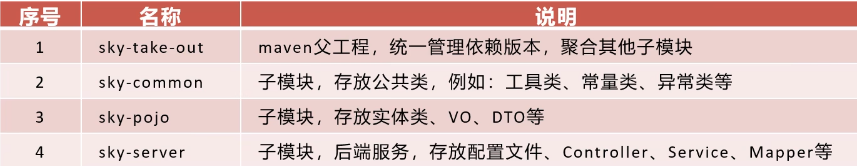

# Recording

### day-1
- pojo: 只有属性,getter / setter,就是个普通对象
- Entity: 和数据库表一一对应
- DTO: Data Transfer Object, 传数据
- VO: 给前端展示用
- controller: 接 HTTP 请求,返回响应,用 DTO 接参数
- service: 业务
- mapper: 写数据库的CRUD


```txt
开发：application-dev.yml（本地数据库）
测试：application-test.yml（测试库）
线上：application-prod.yml（线上库）

interceptor（拦截器）
handler（全局异常）
config（各种 Bean 配置）
```
- MD5: 哈希算法，把任意长度的数据 → 固定长度的指纹，即32位字符串，不可逆
> 123456  MD5—>  e10adc3949ba59abbe56e057f20f883e
> > 已被淘汰，加密程度不够
- TODO: 标记未完成的事
- FIXME： 有bug，需要修复
- NOTE： 记录一些笔记，刻意说明
- YApi: 接口管理
- Knife4j：接口文档
- Swagger：接口文档
- apifox：推荐使用，本人所用，替代swagger

- git test